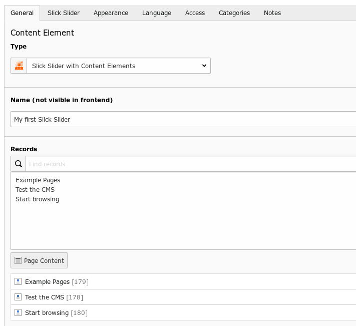
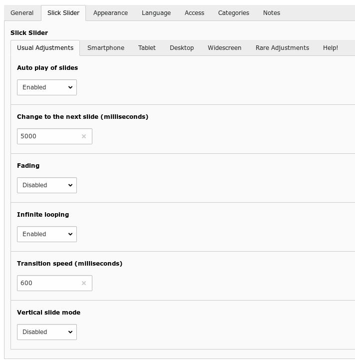

.. ==================================================
.. FOR YOUR INFORMATION
.. --------------------------------------------------
.. -*- coding: utf-8 -*- with BOM.

.. include:: ../../../../Includes.txt

.. _introduction_screenshots_backend_slickcontent:

Slick Slider with Content Elements
==================================

	Slick Slider with Content Elements

If you are using the Slick Slider with Content Elements, you can add every content element to the slider like 
headers, texts, images, sitemaps and html code among others.

	Slick Slider with the usual adjustments

There are a lot properties for adjustment:

* Usual adjustments

* Smartphone

* Tablet

* Desktop

* Wide screen

* and so called Rare adjustments