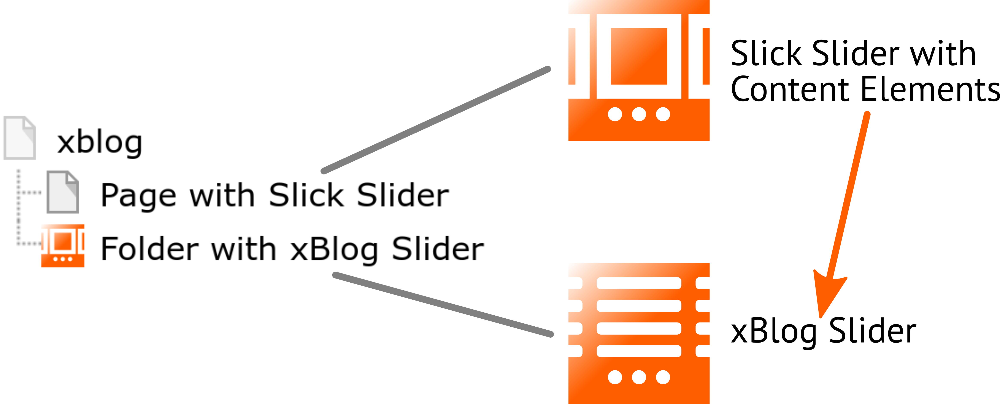

.. ==================================================
.. FOR YOUR INFORMATION
.. --------------------------------------------------
.. -*- coding: utf-8 -*- with BOM.

.. include:: ../../../../Includes.txt

.. _users_slick_content_xblog:

	TYPO3 xBlog Slider and the Slick Slider (schematic representation)

xBlog
=====

The extension xBlog enables you, to display records of each extension with the Slick Slider.

Please refer to the manual at

* `xBlog > Users > Best Practice > Slider <https://docs.typo3.org/typo3cms/extensions/xblog/Users/BestPractice/Slider/>`_

If link from above doesn't work, please refer to

* `xBlog <https://docs.typo3.org/typo3cms/extensions/xblog/>`_

and search for the word "slider".