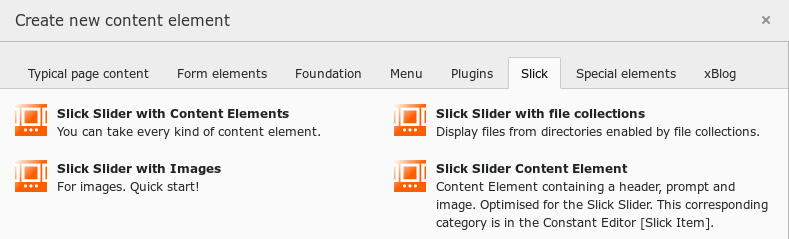

.. ==================================================
.. FOR YOUR INFORMATION
.. --------------------------------------------------
.. -*- coding: utf-8 -*- with BOM.

.. include:: ../../../../Includes.txt

.. _introduction_screenshots_backend_wizard:

New Content Element Wizard
==========================

	New Content Element Wizard with Slick

Slick provides four content elements:

* the slick slider with content elements (from TYPO3 8.7)

* the slick slider with file collections (from TYPO3 8.7)

* the slick slider with images (from TYPO3 8.7)

* and the slick slider item

You can use other slick slider content elements from former TYPO3 versions, 
but they aren't needed any longer and they are marked as deprecated.